## 技术栈

### 前端

构建工具 Vite

前端框架 Vue

路由模块 Vue Router

网络请求 axios

状态管理 Pinia

### 后端

开发语言 Java

开发框架 Spring Boot

接口调试工具 Postman、Swagger

持久层框架 MyBatis

数据库 MySQL

鉴权 JWT

## 系统概述
本系统是一款基于 Vue 和 Spring Boot 框架的在线电子商城系统，旨在提供快速、方便的购物体
验，以满足消费者的个性化需求。前端部分使用 Vue 框架，同时使用 Vite 构建工具、Vue Router 路由
模块和 Pinia 状态管理库，通过 axios 网络库实现与后端接口的数据交互，实现了良好的用户界面与用
户体验。后端部分使用 Java 开发语言，使用 Spring Boot 框架和 MyBatis 持久层框架构建，使用 MySQL
数据库存储数据，同时使用 JWT 进行鉴权，以确保数据传输的安全性和可靠性。除此之外，还使用
Postman 接口调试工具、Swagger 框架进行接口测试，进一步保证系统的稳定性和可靠性。该项目包
含了用户注册、用户登录、个人主页、商品分类、商品详情页、商品搜索、购物车、订单页等功能。

## 系统模块图

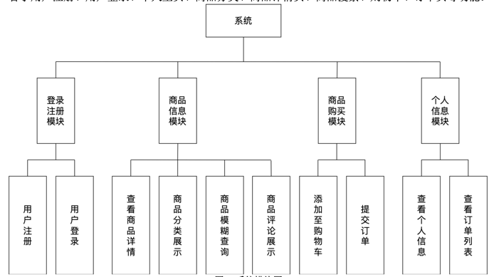

## 项目效果展示

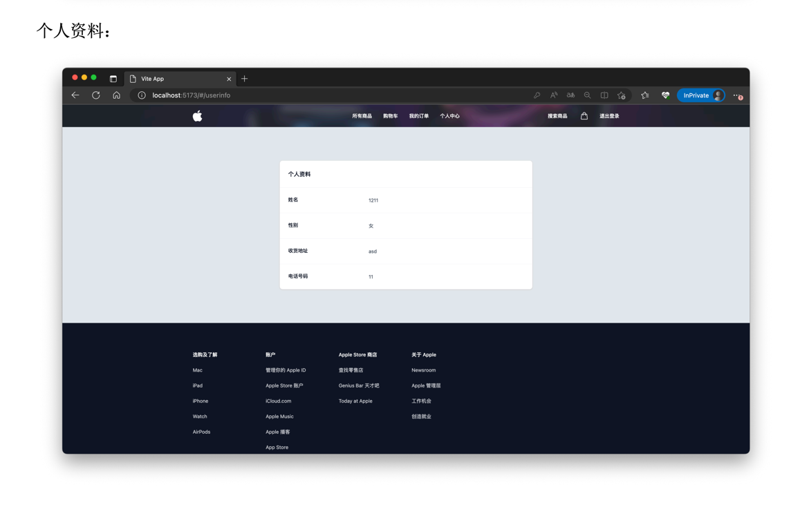

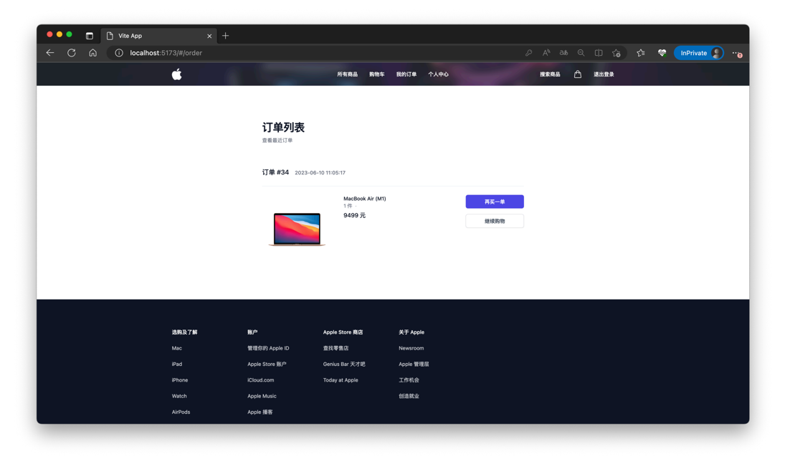

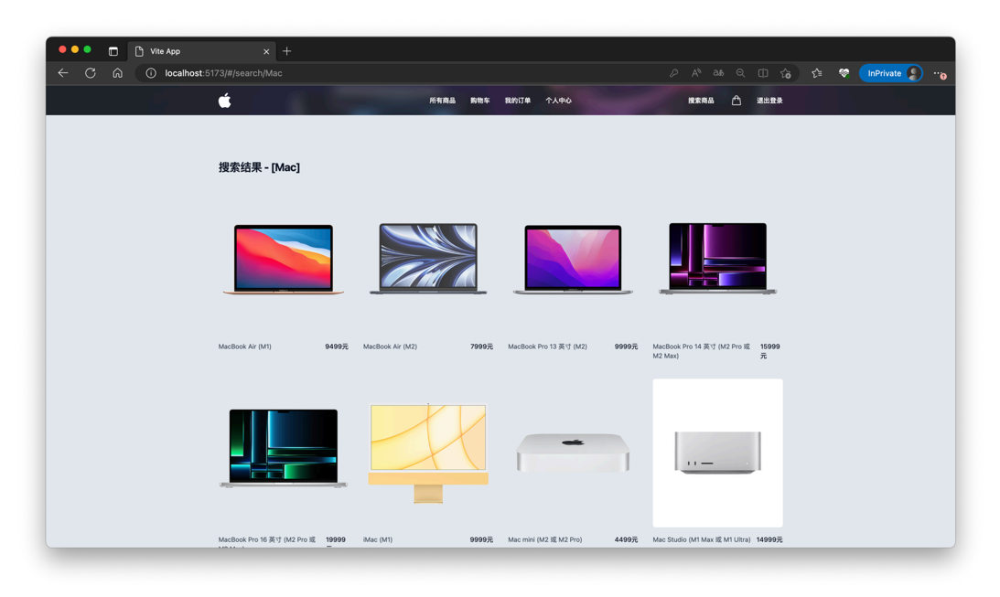

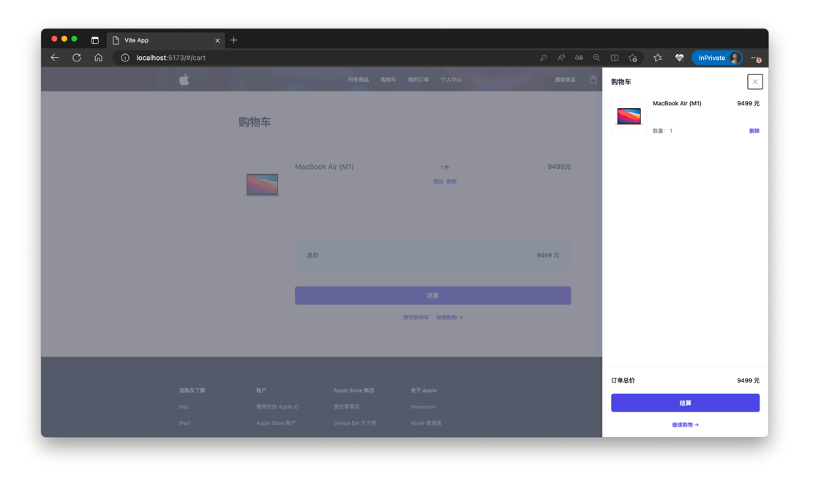

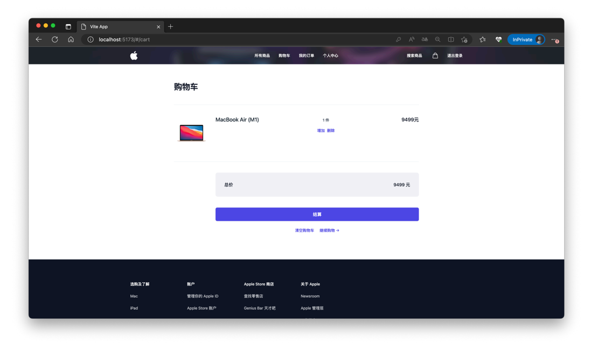

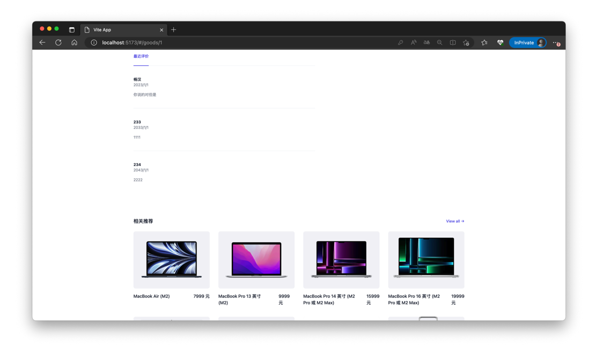

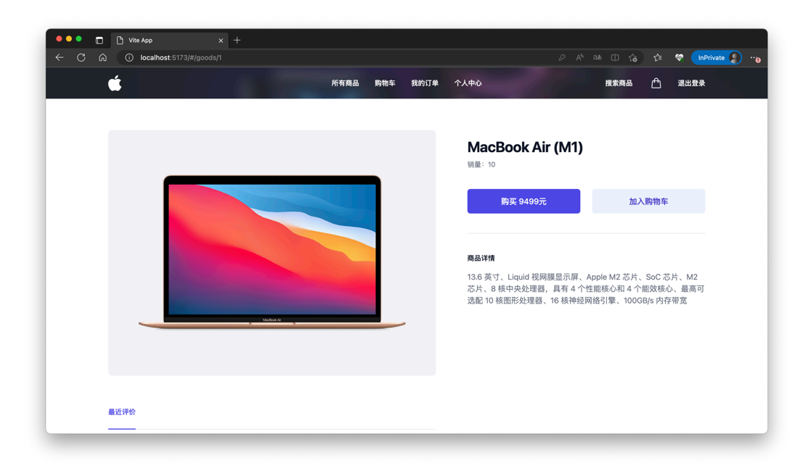

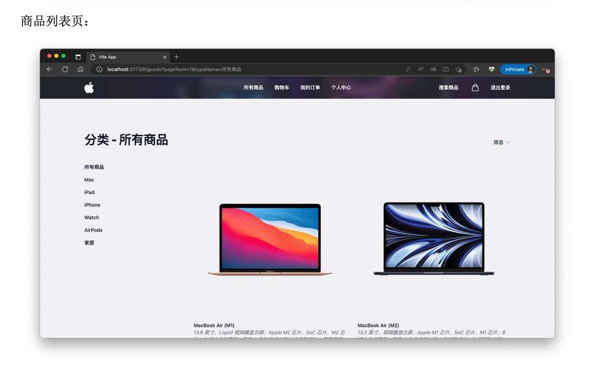

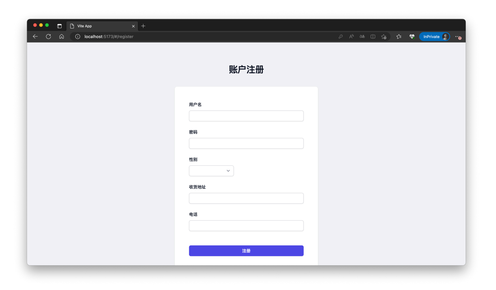

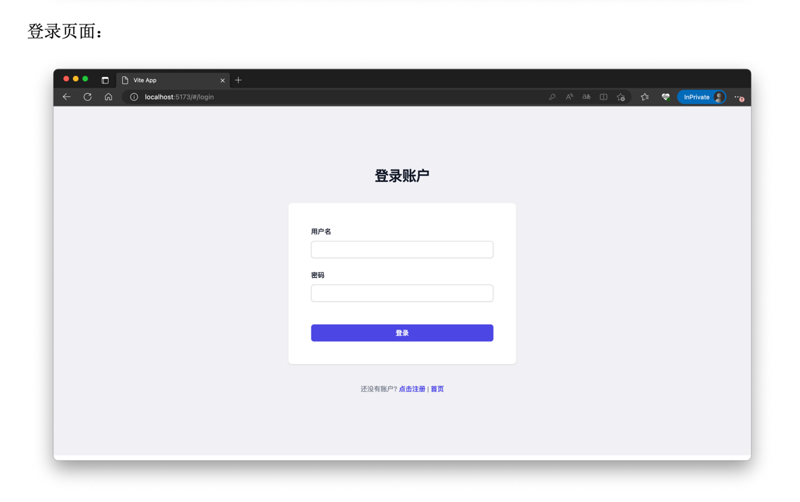

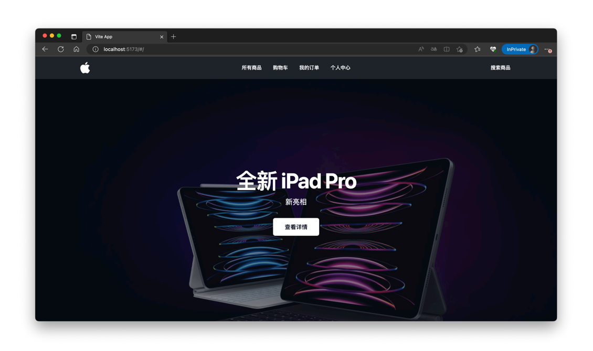

## 登录注册模块的实现
实现类 UserServiceImpl 通过调用接口 UserService 中的方法对用户进行操作。其中，registerService
方法用来进行用户注册，首先调用 userDao 下的 findByUname 方法判断要注册的用户是否已经存在，
如果不存在，就调用 register 方法向数据库中插入一条记录，同时返回当前插入的用户信息。如果已
经存在，则返回 null。

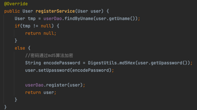

loginService 方法用来进行用户登录，通过调用 userDao 下的 login 方法实现。最后，在控制层
UserController 中，使用@RestController 和@RequestMapping 注解来标记处理请求的方法，使用
@Autowired 注解自动注入 UserService 对象，来调用相应的用户服务方法，完成用户登录和注册操作。
同时也调用了 JWTUtils，将用户信息以 token 的形式返回给前端。

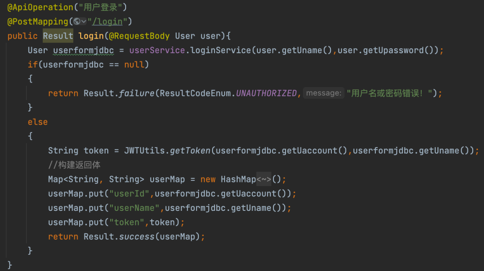

## 商品信息模块的实现
商品信息模块主要功能包括：商品模糊查询，商品分类展示，商品评论展示以及商品详情页。
商品模糊查询的实现是在前端页面，用户输入一个商品名称（gname）。前端页面通过发送 HTTP
请求，将该商品名称以及页面号（pageNum）和每页数量(pageSize)一并发送给后端服务。后端服务通
过实现 search 方法，调用 searchGoodsByName 方法进行模糊查询，并将查询结果封装成一个包含商
品列表和分页信息的 PageInfo 对象，返回给前端页面。
对于商品图片的地址处理，使用 for 循环遍历查询结果，利用商品的图片地址属性和一个存放在
配置文件中的服务器地址，将商品的图片地址转换成完整的 URL 地址，然后重新设置商品对象属性，
在最终的商品列表中返回给前端。

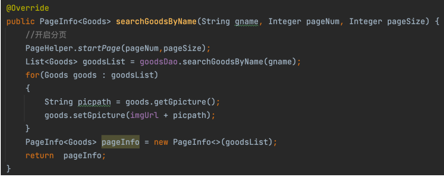

在 select 语句的 SQL 语句中加入了 WHERE 子句和 LIKE 运算符，从而实现了对商品名称的模糊
匹配。

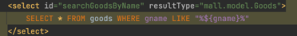

商品分类展示和商品评论展示的实现大部分与商品模糊查询类似，不再赘述。

## 商品购买模块的实现
商品购买模块主要功能包括：商品销量增加、添加购物车以及提交订单。
商品销量增加的实现是在用户提交订单时，通过调用 cartDao 的 updateSales 方法。

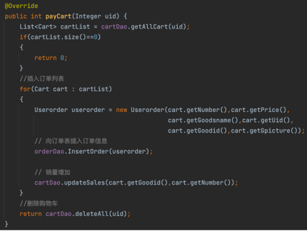

在 update 语句的 SQL 语句中，通过使用 gid 和 number 两个参数，将 goods 表中该商品的销售量
增加 number。

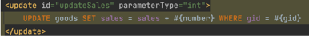

添加购物车先通过 getCartByUGid 方法查询一下当前用户和该商品是否已经在购物车中存在了，
如果存在，则在原来的购物车记录数量之上进行累加，并计算新的价格，然后更新数据库中的购物车
记录。如果不存在，则直接在购物车中新加入该商品。无论是更新还是新加入，最后都将最新的购物
车记录返回给前端。

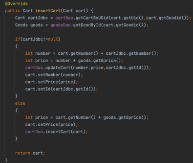

订单功能与购物车类似不再赘述。

## 个人信息模块的实现
个人信息模块主要功能包括：通过用户 id 获取用户详情以及个人信息修改。
其中个人信息修改的代码实现如下：首先，通过 uid 查询用户是否存在，如果存在则修改其信息
（性别、地址、电话），并用 updateUserInfo 方法更新用户信息。如果更新成功，返回 Result 对象
的 success 表示操作成功，如果更新失败，返回 failure 表示操作失败，并给出相应提示信息。

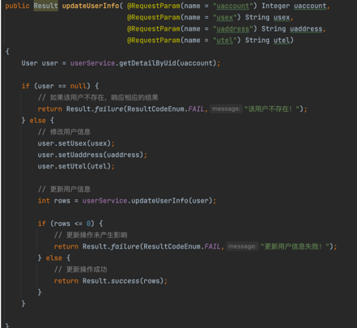