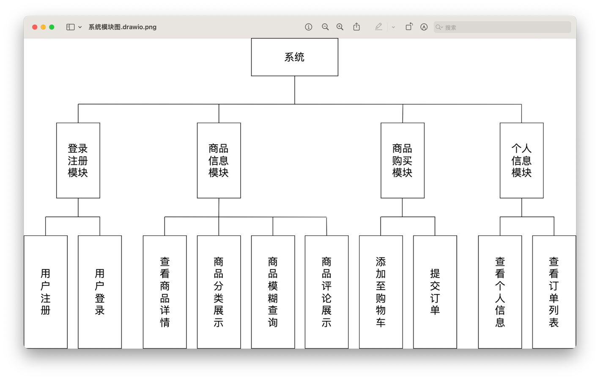

# 在线电子商城系统

## 项目概述

本系统是一个基于 Vue 和 Spring Boot 构建的在线电子商城。它旨在为用户提供一个流畅、便捷且功能丰富的购物平台，满足消费者的多样化与个性化需求。

前端采用 Vue 全家桶技术，并利用 Vite 进行高效构建，确保了卓越的用户体验和界面交互。后端则基于 Spring Boot 框架，结合 MyBatis 持久层和 MySQL 数据库，并通过 JWT (JSON Web Token) 实现安全的身份认证，保障了系统的稳定与数据安全。

项目实现了包括用户注册登录、商品分类浏览、商品详情展示、关键词搜索、购物车管理以及订单处理在内的电商核心功能。

## 技术选型

### 前端

- **构建工具**: Vite
- **核心框架**: Vue.js
- **路由**: Vue Router
- **状态管理**: Pinia
- **HTTP客户端**: Axios

### 后端

- **开发语言**: Java
- **核心框架**: Spring Boot
- **持久层**: MyBatis
- **数据库**: MySQL
- **身份认证**: JWT (JSON Web Token)
- **API 文档与测试**: Swagger, Postman

## 系统模块设计

### 一、用户模块（登录与注册）

该模块负责处理用户的身份认证。

- **注册**: 用户提供必要信息完成注册。后端会校验用户名是否已存在，确保用户账户的唯一性。
- **登录**: 用户通过账号密码登录。成功后，后端会生成一个 JWT Token，用于后续请求的身份验证。

### 二、商品信息模块

该模块负责商品数据的展示与检索。

- **商品展示**: 支持按分类展示商品列表。
- **模糊搜索**: 用户可根据商品名称进行模糊查询，系统会返回匹配的商品列表及分页信息。
- **商品详情**: 展示单个商品的详细信息，包括图片、介绍和用户评论。

为了提供完整的图片URL，后端会遍历查询结果，将数据库中存储的相对图片路径与服务器地址拼接，形成可访问的URL地址。

### 三、商品购买模块

该模块实现了完整的购物流程。

- **添加购物车**: 用户可以将商品加入购物车。系统会自动判断该商品是否已在购物车中：
  - **若已存在**: 则更新商品数量和总价。
  - **若不存在**: 则在购物车中创建一条新记录。
- **提交订单**: 用户在购物车中选择商品并提交订单。提交成功后，系统会相应地增加商品的销售��。

### 四、个人中心模块

该模块允许用户管理个人信息。

- **信息查询**: 用户可以查看自己的个人信息，如性别、地址和联系电话。
- **信息修改**: 用户可以编辑并更新自己的个人资料。后端会校验用户身份，并对提交的数据进行持久化处理。

### 五、文档地址

http://localhost:8080/swagger-ui/index.html